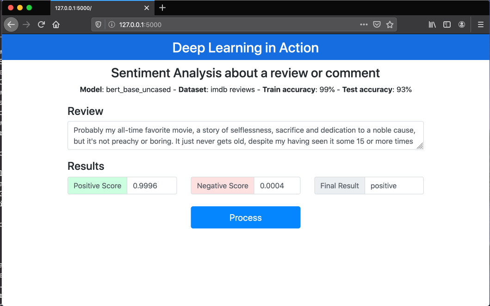

# bert_sentiment_flask
Using flask API to predict the sentiment using BERT model
Inspired on https://github.com/abhishekkrthakur/bert-sentiment/



# To fine tune the model 
All files need to retrain is included.

Adjust paths, epochs in src/config.py

Run the command:

```
cd src
python train.py
```

# To start the app
Adjust the PATH to the model in src/config.py

Run the command:
```
cd src
python app.py
```
